# 操作系统实验报告：Lab1 比麻雀更小的麻雀（最小可执行内核）

## 实验基本信息

| 项目 | 内容 |
| --- | --- |
| 实验名称 | Lab1：比麻雀更小的麻雀（最小可执行内核） |
| 小组成员 | 蒋林瀞、马传志、王麒萱 |
| 完成日期 | 2026-10-08 |

### 小组分工

练习分工：

**练习 1：理解内核启动中的程序入口操作**

**蒋林瀞**：查阅 kern/init/entry.S 与相关链接脚本内容，分析 la sp, bootstacktop 的作用及内核栈设置过程，并参与 GDB 单步验证。  
**马传志：** 分析 tail kern_init 的跳转机制及其与普通函数调用的区别，结合 kern_init 的入口地址和执行过程完成结果验证与文字整理。  
**王麒萱：** 参与练习 1 的 GDB 调试，记录 PC、SP 等寄存器在指令执行前后的变化，整理 bootstacktop、kern_init 相关截图和实验现象。

**练习 2：使用 GDB 验证启动流程**

**蒋林瀞：**负责从 QEMU 加电后 0x1000 复位地址开始进行调试，分析最初几条关键启动指令及其功能，并记录相关寄存器变化。  
**马传志：**重点分析 0x1000 → 0x80000000 → 0x80200000 的完整启动流程，验证 OpenSBI 入口、内核入口以及控制权转移过程，并整理主要结论。  
**王麒萱：** 参与 OpenSBI 到 kern_entry 的调试验证，检查断点、寄存器和 FDT 相关信息，整理练习 2 的实验截图及调试记录。

**实验截图和报告整理：**

**蒋林瀞：**整理实验环境、编译过程及 QEMU 运行以及GDB单步调试相关截图，并参与图注与实验步骤说明的编写。  
**马传志：**整理 GDB 调试、内核入口、SBI 调用链等核心分析内容，并负责整体逻辑、实验结论和总结部分的完善。  
**王麒萱：**整理寄存器变化、内核栈、kern_init 执行过程等截图，负责部分图表排版、文字校对和格式统一。

实验报告分工：

**蒋林瀞：**负责实验环境、编译运行过程及部分调试过程的文字整理。  
**马传志：**负责实验整体逻辑、两项练习的核心分析、测试验证和实验总结。  
**王麒萱：**负责部分实验结果说明、截图整理、格式调整和全文校对。

## 一、实验目的

本实验围绕最小可执行内核的启动过程展开。主要完成内核编译、镜像生成、QEMU 4.1.1 运行和 GDB 调试，观察 RISC-V 处理器从复位地址进入 OpenSBI，再进入内核入口的过程。

实验中结合 tools/kernel.ld、kern/init/entry.S、kern/init/init.c 和 SBI 输出代码，查看内核的装载地址、入口位置、栈的设置方式以及启动信息的输出过程。通过这些内容理解一个最小内核从“被加载”到“开始执行 C 代码”的基本条件。

## 二、实验环境

实验在 Windows 的 WSL Ubuntu 22.04 环境中完成，目标架构为 RISC-V 64。交叉编译器使用 riscv64-unknown-elf-gcc 10.2.0，GDB 使用 SiFive GDB-Metal 10.1，QEMU 固定使用 4.1.1，启动固件为 OpenSBI v0.4（Runtime SBI Version 0.1）。

在终端执行 qemu-system-riscv64 --version，检查本次实验实际调用的 QEMU 版本。

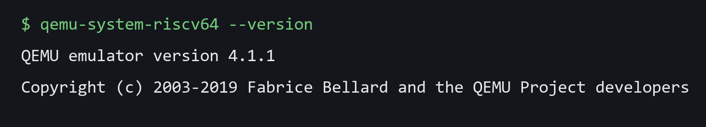

*图 2-1 QEMU 版本检查*

如图 2-1，终端返回 QEMU emulator version 4.1.1，本实验的运行和调试均使用该版本。

## 三、实验整体逻辑分析

### 3.1 实验过程

实验先在 lab1 目录执行 make，生成 bin/kernel 和 bin/ucore.img，并查看链接脚本给出的内核入口地址。随后执行 make qemu 运行内核，检查 OpenSBI 信息和内核启动字符串。GDB 调试从 PC=0x1000 开始，单步查看复位代码如何取出 0x80000000 的固件入口，再在 0x80200000 处设置断点进入 kern_entry。

进入 kern_entry 后，继续查看 la sp, bootstacktop 对 SP 的修改和 tail kern_init 的跳转结果，并在 kern_init 中观察栈帧、.bss 清零、cprintf 字符输出和最终的 while (1) 循环。整份调试记录按 CPU 实际执行的位置组织，地址和寄存器值均来自本次 GDB 输出。

图 3-1 按本次实验观察到的执行顺序列出主要地址和函数。

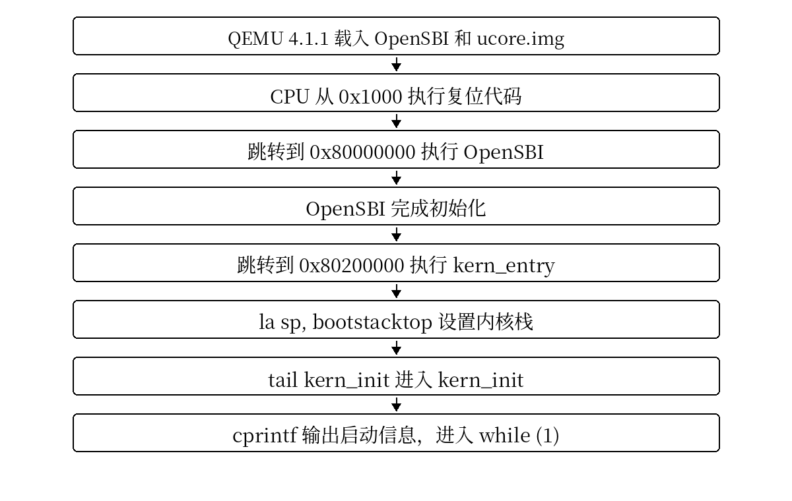

*图 3-1 Lab1 启动主线*

如图 3-1，0x1000 是 QEMU virt 的复位代码地址，0x80000000 是 OpenSBI 的入口，0x80200000 是内核的 kern_entry。entry.S 在 kern_entry 中设置内核栈，再转入 kern_init。

### 3.2 本实验用到的主要文件

tools/kernel.ld 规定内核的入口和各段在内存中的位置；kern/init/entry.S 提供最开始执行的内核汇编代码，负责设置 SP 并转入 C 函数；kern/init/init.c 中的 kern_init 完成最小初始化并调用 cprintf；kern/libs/stdio.c、kern/driver/console.c 和 libs/sbi.c 组成字符输出路径，最底层通过 ecall 调用 SBI 服务。

### 3.3 关键原理：镜像装载、固件初始化与内核入口的分工

**镜像装载与控制权移交是两个不同的操作。** 本实验的 Makefile 使用 `-bios default` 选择 QEMU 默认固件，并通过 `-device loader,file=bin/ucore.img,addr=0x80200000` 指定由 **QEMU loader** 把内核镜像放入物理地址 `0x80200000`。CPU 则先从 `0x1000` 的复位代码出发，跳到 `0x80000000` 执行 OpenSBI。OpenSBI 在固件阶段完成必要的平台初始化，再将控制权移交到已经放置好的内核入口。

**ELF、二进制镜像与链接地址也需要区分。** `bin/kernel` 是链接产生的 ELF 文件，包含供调试使用的符号等信息；`bin/ucore.img` 是由 `objcopy` 导出的扁平二进制镜像，用于按指定地址放入内存。链接脚本 `tools/kernel.ld` 使用 `BASE_ADDRESS = 0x80200000` 安排内核内存布局，并通过 `ENTRY(kern_entry)` 指定程序入口。本实验中镜像的实际装载位置与链接安排相对应，CPU 跳转到 `0x80200000` 才能执行预期的入口指令。

**从汇编入口过渡到 C 代码需要先建立内核栈。** OpenSBI 将控制权移交给内核，并不意味着已经为 `kern_init` 准备好可直接依赖的内核栈。`entry.S` 利用预留的 `bootstack` 空间将 `sp` 设置到 `bootstacktop`，再执行 `tail kern_init`；随后 C 函数可在这片栈空间中建立栈帧。另外，本实验内核没有依赖现成操作系统的用户态标准输出服务，字符输出通过 `cprintf → vcprintf/vprintfmt → cputch → cons_putc → sbi_console_putchar → ecall` 逐层实现，最终请求 SBI 控制台服务。

## 四、实验内容与实现

### 4.1 编译内核并查看运行结果

#### 4.1.1 执行 make

在 lab1 根目录执行 make。Makefile 依次调用 RISC-V 交叉编译器编译 kern/init/entry.S、kern/init/init.c、控制台代码和基础库，再调用链接器生成 bin/kernel，并用 objcopy 生成 bin/ucore.img。

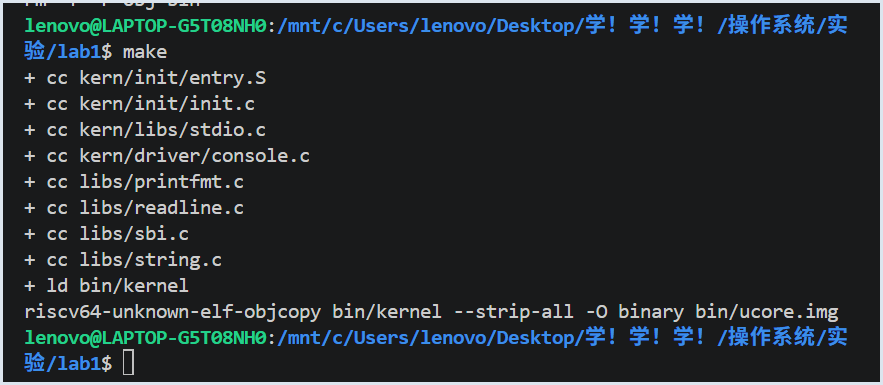

*图 4-1 执行 make 的编译输出*

如图 4-1，终端中每一行 “+ cc” 对应一个源文件的编译；“+ ld bin/kernel” 表示目标文件已经链接为内核 ELF；最后一条 objcopy 命令把 bin/kernel 转换为 bin/ucore.img。整个 make 过程没有出现编译或链接错误。

执行 ls bin，查看 make 在 bin 目录中生成的文件。

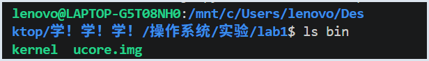

*图 4-2 bin 目录中的内核文件*

如图 4-2，bin 目录中有 kernel 和 ucore.img 两个文件。kernel 是链接得到的 ELF 文件，其中保留了段、符号和调试信息；ucore.img 是从 kernel 中导出的二进制镜像。

#### 4.1.2 查看内核地址

查看 tools/kernel.ld 中的 ENTRY(kern_entry) 和 BASE_ADDRESS = 0x80200000，并使用 readelf、nm 检查实际生成的 bin/kernel。readelf -h 用来查看 ELF 入口，readelf -SW 用来查看各 section 的地址和大小，nm -n 按地址列出符号。

riscv64-unknown-elf-readelf -h bin/kernel

riscv64-unknown-elf-readelf -SW bin/kernel

riscv64-unknown-elf-nm -n bin/kernel

| 对象 | 地址/长度 | 作用 |
| --- | --- | --- |
| kern_entry / kern_init   | 0x80200000 / 0x8020000a | 汇编入口 / C 函数入口     |
| .text                    | 0x80200000，长度 0x4a2  | 机器指令                  |
| .rodata                  | 0x802004a8，长度 0x270  | 格式串和只读常量          |
| .data                    | 0x80201000，长度 0x2000 | 主要用于预留 8 KiB 初始栈 |
| bootstack / bootstacktop | 0x80201000 / 0x80203000 | 栈区下边界 / 初始栈顶     |
| .sdata                   | 0x80203000，长度 8 字节 | 小数据区                  |
| edata / end              | 均为 0x80203008         | 本次 .bss 清零长度为 0    |

查询结果中，kern_entry 位于 0x80200000，bootstack 位于 0x80201000，bootstacktop 位于 0x80203000。.data 中为 bootstack 预留 0x2000 字节，也就是 8 KiB。该结果与 entry.S 中的栈定义和 kernel.ld 中的地址安排一致。

从地址关系可以看出，内核入口位于镜像起始位置；启动栈单独放在后面的 .data 区域。bootstack 是这段栈空间的低地址边界，bootstacktop 是高地址边界。RISC-V 的栈向低地址增长，所以初始化 SP 时使用 bootstacktop。

#### 4.1.3 使用 QEMU 运行内核

执行 make -n qemu，只打印 Makefile 中 qemu 目标对应的命令，不真正启动 QEMU。

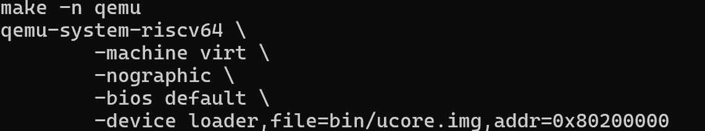

*图 4-3 Makefile 中的 QEMU 启动命令*

如图 4-3，启动参数使用 -machine virt 模拟 RISC-V virt 平台，-nographic 把串口输出显示在当前终端，-bios default 使用 QEMU 默认固件，-device loader 将 bin/ucore.img 装载到物理地址 0x80200000。这个地址与 kernel.ld 中的内核起始地址相同。这里负责把镜像放入内存的是 QEMU loader；OpenSBI 的作用是完成固件阶段初始化，并把控制权移交给已经装载好的内核，而不是执行这条 loader 装载命令。

执行 make qemu，按 Makefile 中的配置启动 QEMU 并运行内核镜像。

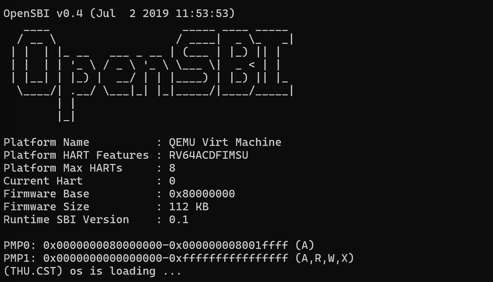

*图 4-4 QEMU 4.1.1 启动内核*

如图 4-4，OpenSBI 显示 Firmware Base=0x80000000、Runtime SBI Version=0.1，随后终端打印 “(THU.CST) os is loading ...”。这行字符串由 kern_init 中的 cprintf 输出。输出后程序进入 while (1)，因此终端保持在 QEMU 运行状态。

### 4.2 练习 1：理解内核启动中的程序入口操作

打开 kern/init/entry.S，kern_entry 中只有两项主要操作：la sp, bootstacktop 设置 SP，tail kern_init 跳转到 C 函数。GDB 单步用于查看两条伪指令对应的机器指令以及执行前后的寄存器值。

#### 4.2.1 la sp, bootstacktop

GDB 停在 kern_entry 后执行 x/6i $pc，反汇编当前地址附近的机器指令。

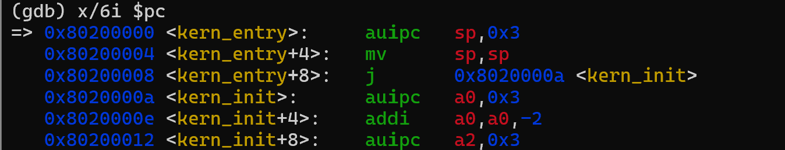

*图 4-5 kern_entry 的实际反汇编*

如图 4-5，la sp, bootstacktop 在本次程序中展开为 0x80200000 和 0x80200004 处的两条机器指令；0x80200008 处的 j 指令对应 tail kern_init。这里显示的是汇编伪指令经过汇编器处理后的实际执行形式。

执行 info registers pc sp，记录 la 执行前的 PC 和 SP。

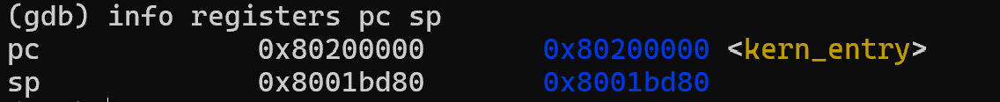

*图 4-6 执行 la 前的 SP*

如图 4-6，PC=0x80200000，SP=0x8001bd80。此时 CPU 已经到达 kern_entry，但还没有执行设置内核栈的指令。此时 SP 仍保留内核入口之前启动阶段的值，尚未被设置为本内核的栈顶。

执行一次 si，再次查看 PC 和 SP，记录 la 第一条实际指令执行后的变化。

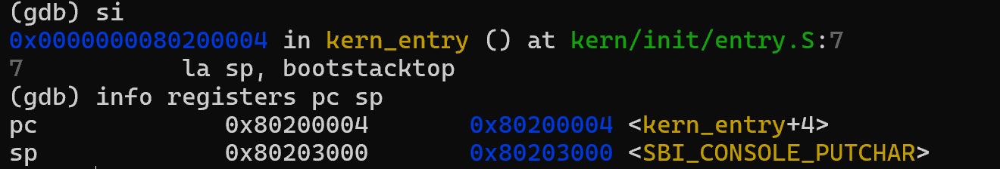

*图 4-7 执行 la 后的 SP*

如图 4-7，SP 变为 0x80203000，PC 前进到 0x80200004。SP 的数值正好落在内核预留栈的高地址边界。

执行 p/x &bootstacktop，直接查询链接符号 bootstacktop 的地址。

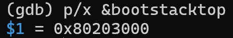

*图 4-8 bootstacktop 的符号地址*

如图 4-8，bootstacktop=0x80203000，与 SP 的值一致。la sp, bootstacktop 的作用就是把这个符号对应的地址装入 SP。

entry.S 通过 .space KSTACKSIZE 预留 0x80201000～0x80203000 这一段空间，共 8 KiB。栈从高地址向低地址增长，所以初始 SP 放在 0x80203000，压栈时使用该地址以下的空间。从这里可以推断出：la sp, bootstacktop 这个指令用于建立内核自己的栈。

#### 4.2.2 tail kern_init

继续单步执行 tail kern_init，并查看跳转后的 PC 和 SP。

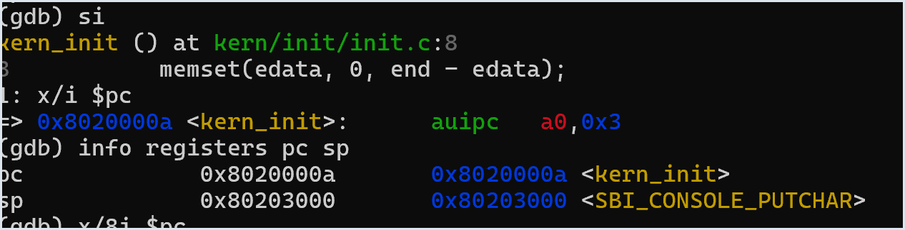

*图 4-9 tail kern_init 后进入 C 代码*

如图 4-9，PC=0x8020000a，当前函数为 kern_init，SP 仍为 0x80203000。tail 在本次程序中使用直接跳转，不为 entry.S 保存新的返回地址。

练习 1 中，la sp, bootstacktop 把内核栈顶地址写入 SP，为 C 函数准备栈空间；tail kern_init 把 PC 改到 kern_init 的入口。kern_init 被声明为 noreturn，正常执行不会回到 entry.S。

#### 4.2.3 练习 1：题目要求与直接解答

**题目：** 阅读 `kern/init/entry.S`，结合内核启动流程，分别说明 `la sp, bootstacktop` 和 `tail kern_init` 完成了什么操作，以及为什么需要这些操作。

**（1）`la sp, bootstacktop` 完成什么操作？目的是什么？**

它将链接符号 `bootstacktop` 的地址装入栈指针寄存器 `sp`。本次实验中，`bootstacktop=0x80203000`，对应预留的 8 KiB 启动栈的高地址边界。其目的是让内核不再依赖进入内核前保留的 SP 值，为后续 C 函数调用、局部变量和寄存器保存建立可用的内核栈。图 4-6 至图 4-8 的寄存器及符号查询显示，SP 从 `0x8001bd80` 变为 `0x80203000`，与这一解释一致。

**（2）`tail kern_init` 完成什么操作？目的是什么？**

它执行尾跳转，将控制流直接转移到 C 函数 `kern_init`，不为这次跳转写入新的返回地址 `ra`。目的是在完成最基本的栈初始化后，将内核初始化与字符输出工作交给 C 代码，而不再为汇编入口额外建立返回路径。本次反汇编对应 `0x80200008` 处的 `j`，单步后 PC 到达 `0x8020000a`；`kern_init` 被声明为 `noreturn` 并最终停在 `while (1)`，与这一启动设计一致。

### 4.3 练习 2：使用 GDB 验证启动流程

使用 GDB 从 QEMU virt 的复位地址开始单步。实验中分别查看 0x1000 处的复位代码、跳转前的寄存器、0x80000000 处的 OpenSBI 指令，以及 0x80200000 处的 kern_entry。

#### 4.3.1 启动 QEMU 调试模式

在终端 A 执行 make debug。Makefile 给 QEMU 加上 -S 和 -s：-S 让虚拟 CPU 在执行第一条指令前暂停，-s 在本机 1234 端口开启 GDB 远程调试接口。

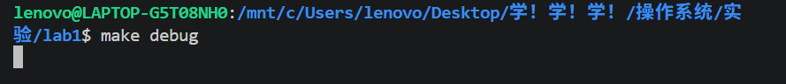

*图 4-10 执行 make debug*

如图 4-10，终端没有继续输出启动信息，QEMU 此时处于暂停状态，等待 GDB 连接。

另开终端 B 执行 make gdb。该目标先让 GDB 读取 bin/kernel 中的符号信息，设置 RISC-V 64 位架构，再连接 localhost:1234。

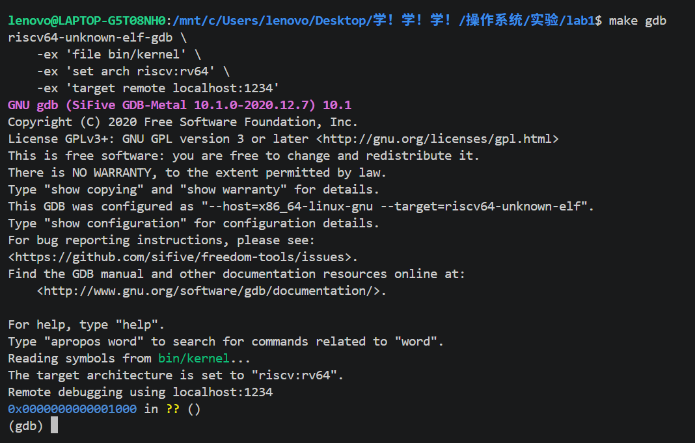

*图 4-11 GDB 连接 QEMU*

如图 4-11，连接完成后 GDB 停在 0x1000。这个地址是 QEMU virt 设置的复位地址，CPU 从这里开始执行本次调试中的第一条指令。

#### 4.3.2 查看 0x1000 处的复位代码

执行 x/8i $pc，从当前 PC 开始反汇编启动代码。

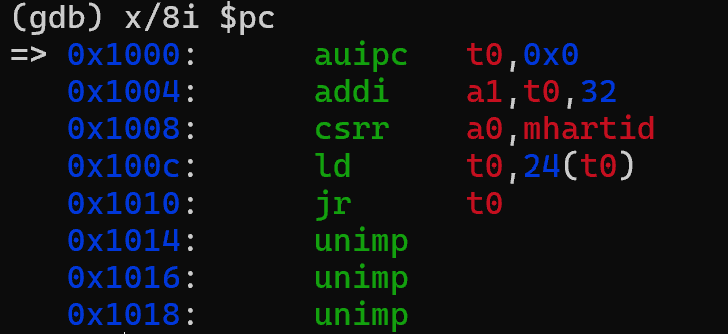

*图 4-12 0x1000 处的复位指令*

如图 4-12，0x1000～0x1010 共五条有效启动指令。auipc 得到以当前 PC 为基准的地址，addi 把 a1 设置为 0x1020，csrr 读取 mhartid 到 a0，ld 从 0x1018 取出 0x80000000，jr t0 按该地址跳转。0x1014 之后显示的 unimp 来自对启动数据的反汇编，并不是本次要执行的正常指令序列。

| 地址 | 指令 | 执行作用 |
| --- | --- | --- |
| 0x1000   | auipc t0,0      | t0 取得 0x1000，建立 PC 相对基址          |
| 0x1004   | addi a1,t0,32   | a1 取得 0x1020，指向 FDT 数据             |
| 0x1008   | csrr a0,mhartid | a0 读取当前 Hart ID，本次为 0             |
| 0x100c   | ld t0,24(t0)    | 从 0x1018 读取 0x80000000 的 OpenSBI 入口 |
| 0x1010   | jr t0           | 跳转到 t0 指向的 OpenSBI 入口             |

使用 GDB 的内存查看命令读取 0x1018 和 0x1020，检查复位代码使用的数据。

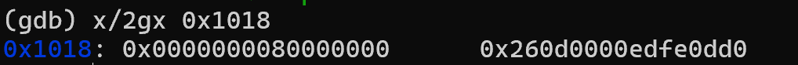

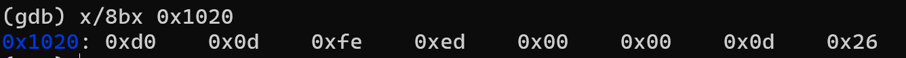

*图 4-13 复位阶段使用的启动数据*

如图 4-13，0x1018 中保存 0x80000000；0x1020 开始的内容以 d0 0d fe ed 开头。0x1018 的数值与前面 ld t0,24(t0) 取出的跳转地址一致。

#### 4.3.3 单步进入 OpenSBI

执行 si 4，连续运行前四条指令，停在 0x1010 的 jr t0 前，再查看 pc、t0、a0 和 a1。

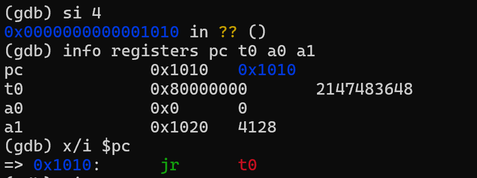

*图 4-14 跳转到 OpenSBI 前的寄存器*

如图 4-14，PC=0x1010，t0=0x80000000，a0=0，a1=0x1020。t0 中保存的就是 jr 即将使用的跳转目标。

执行一次 si，单步运行 jr t0。

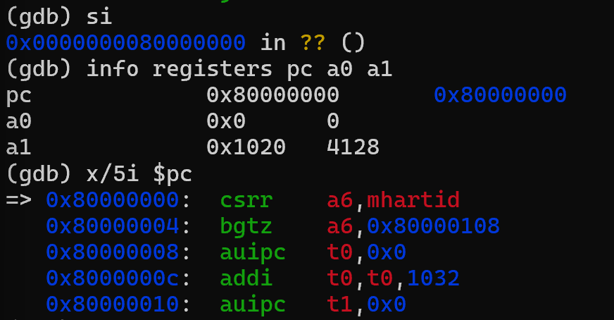

*图 4-15 PC 到达 0x80000000*

如图 4-15，PC 变为 0x80000000，GDB 从该地址开始反汇编 OpenSBI 的指令。

#### 4.3.4 从 OpenSBI 进入内核

执行 b *0x80200000，在内核入口地址设置断点；再执行 continue，让 QEMU 继续运行到该地址。

(gdb) b *0x80200000

(gdb) continue

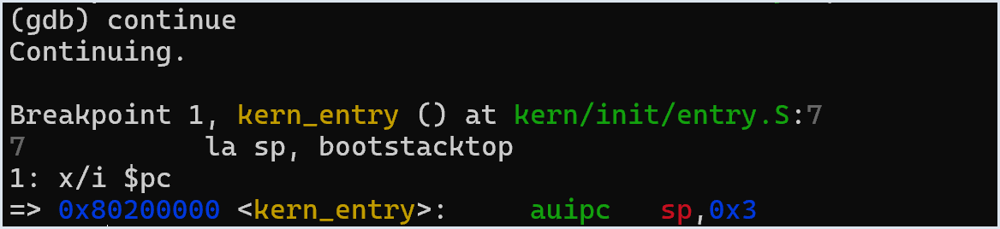

*图 4-16 内核入口断点命中*

如图 4-16，断点命中 kern/init/entry.S 第 7 行，PC=0x80200000，当前位置对应 kern_entry 中的 la sp, bootstacktop。

执行 info registers pc sp a0 a1，记录刚进入 kern_entry 时的寄存器。

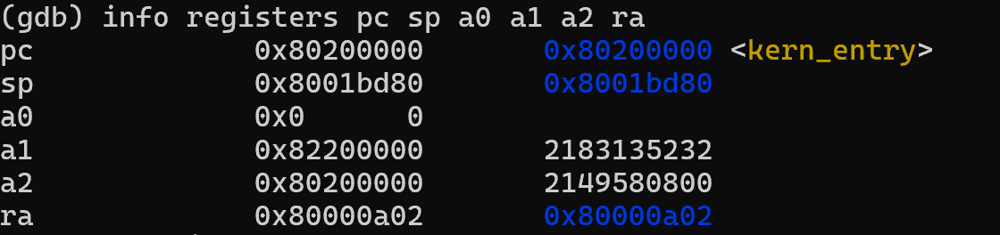

*图 4-17 进入内核时的寄存器*

如图 4-17，PC=0x80200000，SP=0x8001bd80，a0=0，a1=0x82200000。SP 仍是进入内核前保留的值，entry.S 中的 la 尚未执行。

执行 x/8bx $a1，按字节读取 a1 指向地址的前 8 个字节。

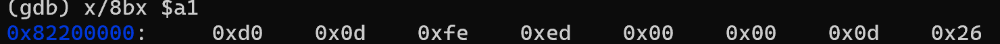

*图 4-18 内核入口处 a1 指向的数据*

如图 4-18，前四个字节为 d0 0d fe ed，这是 FDT 的魔数。a1 此时保存的是设备树地址。

练习 2 记录到的主要执行地址为 0x1000、0x80000000 和 0x80200000，分别是复位代码、OpenSBI 和 kern_entry 的位置。

#### 4.3.5 练习 2：题目要求与直接解答

**题目：** 使用 GDB 从 QEMU 模拟的 RISC-V 处理器加电开始跟踪，直到执行内核第一条指令；回答处理器最初执行的几条指令位于哪里、分别发挥什么作用。

**（1）最初的指令位于什么地址？**

在本次使用的 QEMU 4.1.1 `virt` 平台配置下，GDB 连接后首先观察到 `PC=0x1000`，因此最初执行的是 `0x1000` 附近的复位代码，而不是直接从 OpenSBI 的 `0x80000000` 或内核的 `0x80200000` 开始。图 4-12 显示，`0x1000` 至 `0x1010` 有五条实际执行的启动指令。

**（2）这五条指令主要完成了什么功能？**

- `0x1000: auipc t0,0`：将当前 PC 相对基址 `0x1000` 放入 `t0`，为后续计算地址做准备。
- `0x1004: addi a1,t0,32`：计算得到 `a1=0x1020`，将启动阶段的设备树（FDT）地址作为参数传递。
- `0x1008: csrr a0,mhartid`：读取当前硬件线程（Hart）编号到 `a0`；本次观察值为 0。
- `0x100c: ld t0,24(t0)`：从 `0x1018` 读取下一阶段入口地址，得到 `t0=0x80000000`。
- `0x1010: jr t0`：按 `t0` 的值跳转，将控制权交给 OpenSBI。

**（3）如何验证后续确实进入了内核？**

图 4-14 与图 4-15 证明 `jr t0` 使 PC 从 `0x1010` 到达 `0x80000000`；随后在 `0x80200000` 设置的断点命中 `kern_entry`（图 4-16），说明固件阶段已将控制权交给内核。图 4-17、图 4-18 还记录了内核入口的寄存器与设备树魔数。由此验证完整路径为 **复位代码 `0x1000` → OpenSBI `0x80000000` → 内核入口 `0x80200000`**。这个路径描述的是 CPU 控制流，内核镜像的装载由前述 QEMU loader 参数独立完成。

### 4.4 查看 kern_init 的执行

进入 kern_init 后，继续使用 GDB 查看函数建立栈帧、调用 memset、调用 cprintf 以及进入 while (1) 时的指令和寄存器。

#### 4.4.1 查看 kern_init 的栈

单步执行到 addi sp,sp,-16，并查看执行前后的 SP。该指令从当前栈顶向低地址移动 16 字节。

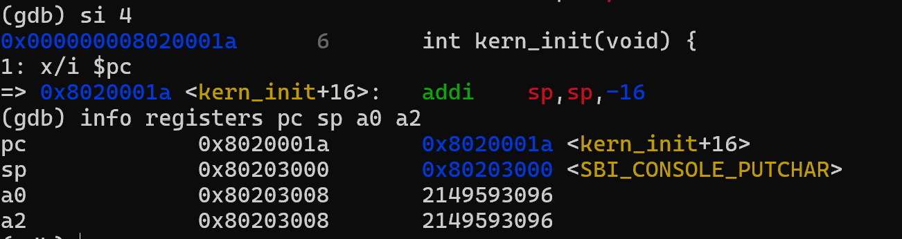

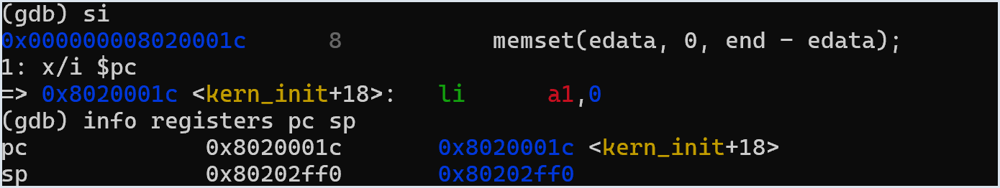

*图 4-19 kern_init 建立自己的栈帧*

如图 4-19，SP 从 0x80203000 变为 0x80202ff0，kern_init 在内核栈中留出 16 字节空间。函数中的寄存器保存和临时数据都使用这段栈空间。

#### 4.4.2 查看 .bss 清零

执行到 memset(edata, 0, end - edata)，查看传入的 a0、a1、a2。a0 对应 edata，a1 为填充值 0，a2 对应 end-edata。符号表中 edata=end=0x80203008，所以本次长度参数 a2 为 0。

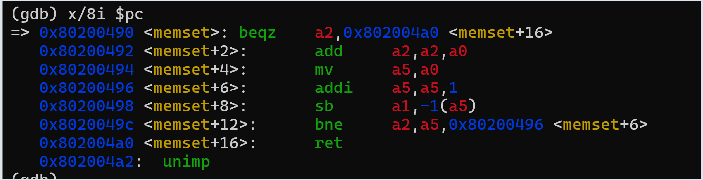

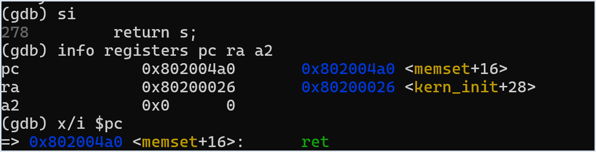

*图 4-20 memset 的零长度分支*

如图 4-20，a2=0，memset 入口先执行 beqz 检查长度，并直接跳到 ret。本次镜像中 .bss 没有需要逐字节清零的内容。

#### 4.4.3 查看字符输出过程

单步到 cprintf("%s\n\n", message) 调用前，查看参数寄存器 a0 和 a1，并用 x/s 读取它们指向的字符串。

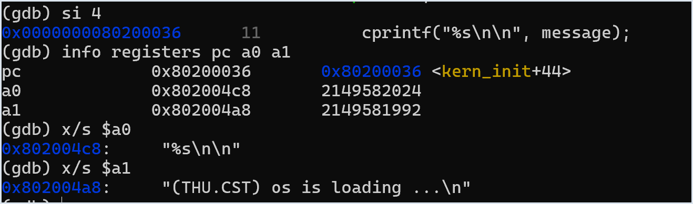

*图 4-21 cprintf 调用参数*

如图 4-21，a0 指向格式串 "%s\n\n"，a1 指向启动字符串 "(THU.CST) os is loading ...\n"。两个字符串都位于 .rodata 区域。

从源码和反汇编中查看字符输出调用链：kern_init 调用 cprintf，格式解析经过 vcprintf 和 vprintfmt，每个字符由 cputch、cons_putc 传给 sbi_console_putchar，sbi_console_putchar 中执行 ecall。

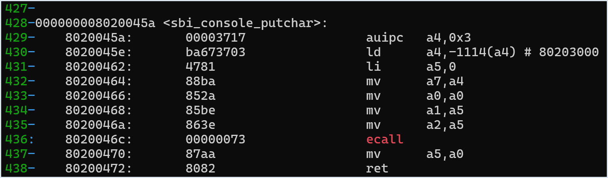

*图 4-22 sbi_console_putchar 中的 ecall*

如图 4-22，ecall 位于 sbi_console_putchar 的调用路径中，地址为 0x8020046c。

在 0x8020046c 设置断点并继续运行，程序在第一次字符输出的 ecall 前停下。此时查看 a0 和 a7。

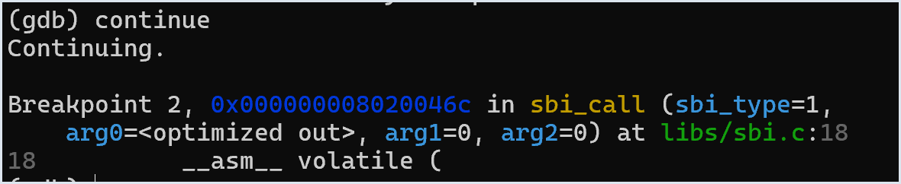

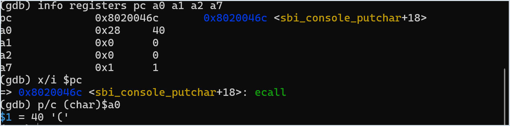

*图 4-23 ecall 断点与寄存器*

如图 4-23，a7=1，表示旧版 SBI 控制台字符输出服务；a0=0x28，对应 ASCII 字符 “(”。这与启动字符串的第一个字符一致。

#### 4.4.4 查看程序最终状态

继续运行程序，等启动字符串输出完成后按 Ctrl+C 中断 GDB，并查看当前 PC 和当前位置的指令。

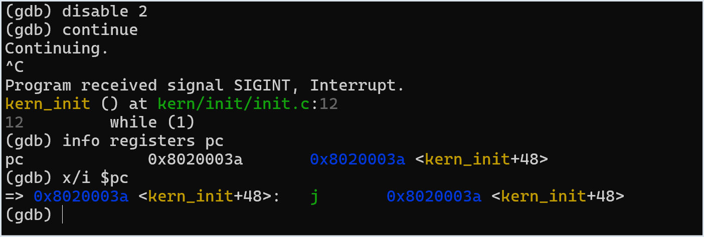

*图 4-24 kern_init 的最终死循环*

如图 4-24，PC=0x8020003a，当前位置是一条跳回自身的 j 指令，对应 kern_init 中的 while (1)。最小内核输出完成后不会退出，而是一直停留在这个循环中。

## 五、测试与验证

### 5.1 编译检查

在 lab1 根目录执行 make，检查编译和链接过程。图 4-1 中 entry.S、init.c、stdio.c、console.c 及基础库均完成编译，随后生成 bin/kernel，并由 objcopy 生成 bin/ucore.img；终端没有出现编译或链接错误。

执行 ls bin 检查输出文件。图 4-2 中可以看到 kernel 和 ucore.img，说明构建结果已经写入 bin 目录。

### 5.2 运行检查

执行 make qemu 检查内核能否在 QEMU 4.1.1 上运行。图 4-4 中 OpenSBI v0.4 正常输出平台信息，Firmware Base 为 0x80000000，随后出现 “(THU.CST) os is loading ...”。

使用 GDB 中断正在运行的内核后，图 4-24 显示 PC=0x8020003a，当前位置为自跳转指令。该结果与 kern_init 中的 while (1) 对应。

### 5.3 GDB 启动流程检查

执行 make debug 和 make gdb 检查启动路径。图 4-11 中 GDB 初始停在 0x1000；图 4-14 显示 jr t0 前 t0=0x80000000；图 4-15 中 PC 到达 0x80000000；图 4-16 中 0x80200000 断点命中 kern_entry。

这组调试结果给出了完整的地址变化：0x1000 是复位代码，0x80000000 是 OpenSBI，0x80200000 是内核入口。

### 5.4 练习1结果检查

图 4-6 至图 4-8 记录 la sp, bootstacktop 的执行过程：执行前 SP=0x8001bd80，执行后 SP=0x80203000，查询 bootstacktop 得到的地址同样是 0x80203000。

图 4-9 中 tail kern_init 执行后 PC=0x8020000a，SP 仍为 0x80203000。两条入口指令分别完成栈顶设置和跳转到 kern_init。

## 六、实验总结与收获

### 6.1 本实验中对应的操作系统知识

系统启动：本实验实际观察了 0x1000 → 0x80000000 → 0x80200000 的执行路径。0x1000 处的复位代码负责准备最基本的启动参数并跳到固件；OpenSBI 位于更高特权级，完成固件阶段工作；0x80200000 才是本实验内核的入口。课本中的“固件/引导程序把控制权交给操作系统”在这里对应到了具体地址和指令。

程序链接和内存布局：kernel.ld 不只是把目标文件合在一起，还决定内核各 section 的地址。kern_entry 被放到 0x80200000，bootstack 位于 0x80201000，bootstacktop 位于 0x80203000。QEMU 加载镜像使用同一个 0x80200000，链接地址和实际装载地址需要保持一致。

内核栈和函数调用：entry.S 在进入 C 代码前先设置 SP。GDB 中可以看到 SP 从固件留下的值变为 0x80203000，随后 kern_init 再通过 addi sp,sp,-16 建立自己的栈帧。这里把“栈向低地址增长”和 RISC-V 函数调用约定直接对应到了实际寄存器变化。

特权级和 SBI：内核中的字符输出最终执行 ecall，请求 OpenSBI 提供控制台服务。本实验中内核运行在 S-mode，OpenSBI 运行在 M-mode。它和普通应用程序使用系统调用的思路相似，都是通过受控陷入请求更高权限的软件提供服务，但应用程序通常是 U-mode 进入 S-mode，而这里是 S-mode 请求 M-mode 固件。

可执行文件中的数据段：实验中结合 readelf、nm 和 GDB 查看了 .text、.rodata、.data、.bss 相关地址。代码位于 .text，字符串常量位于 .rodata，启动栈放在 .data。本次 edata 与 end 相同，所以 memset 的清零长度为 0；这也说明 .bss 在文件中主要记录范围，并不需要保存一整段零。

### 6.2 本实验没有涉及的内容

Lab1 只运行一个最小内核，没有创建进程或线程，也没有上下文切换，所以没有涉及进程状态、调度算法、时间片和进程间通信。

本实验使用启动阶段的物理地址，没有建立完整页表和虚拟地址空间，因此没有涉及虚拟地址转换、缺页异常、页面置换和多进程地址空间。

文件系统、磁盘管理、设备驱动和并发同步也没有在 Lab1 中展开。虽然实验中使用了 ecall 和 SBI，但没有实现用户态系统调用，也没有完整展开 trap/中断处理流程。

### 6.3 实验过程中的收获

这次实验把启动过程中的几个地址真正对应到了代码。单步到 0x1010 时可以看到 t0 已经是 0x80000000，执行 jr 后 PC 直接进入 OpenSBI；在 0x80200000 设置断点，又能看到 CPU 停在 entry.S 的第一条指令。相比只看启动流程图，寄存器和反汇编结果更容易说明每一步实际做了什么。

kernel.ld、entry.S 和 kern_init 之间的关系也更直观。kernel.ld 先确定符号地址，entry.S 用 bootstacktop 设置 SP，kern_init 再在这段栈上建立栈帧。只看单个文件时这些内容比较分散，结合符号表和 GDB 后可以把它们连起来。

调试时不能只看源码行号。PC 能说明 CPU 当前执行位置，寄存器能看到参数和跳转目标，反汇编能确认伪指令最终生成了什么机器指令。开启 -O2 后，GDB 中某些源码变量的显示可能不够直观，这时以实际寄存器和机器指令为准更可靠。

### 6.4 AI 协作过程

实验过程中使用 AI 辅助查询 GDB 命令含义、整理调试顺序和检查报告表述。实际地址、寄存器值、QEMU 输出和指令结果都以本机 QEMU 4.1.1 与 GDB 的截图为准。

遇到环境或调试现象不一致时，先检查版本、PATH、Makefile 和 GDB 输出，再根据实际结果调整分析，不直接用文字推测代替实验记录。
